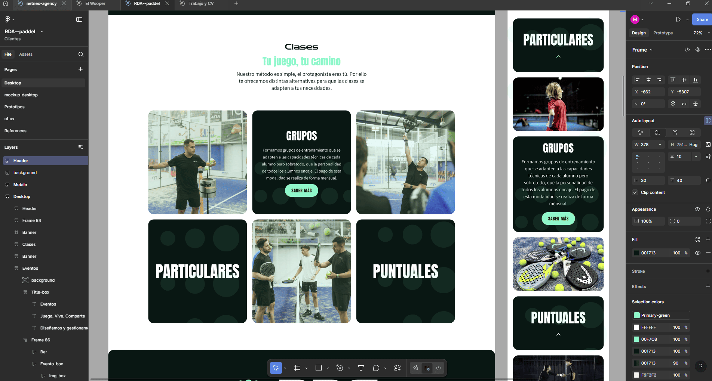

# 🎾 RDA Academia de Padel (Frontend)

  
  
  
  
  
  

---

## 📖 Project Overview

**RDA Academia de Pádel** is a **Single Page Application (SPA)** developed with
**ReactJS** and **Vite**.  
This is the **frontend repository**, and the project is currently **in
progress** — backend integration (Node.js + Express) will be added in the
future.

The website is designed to serve a **padel school**, providing sections for:

- 📰 **News**
- 🎟️ **Events**
- 🎾 **Classes**

The frontend uses **CSS Modules** for modular and maintainable styling.

---

## 🚀 Features (Current)

- ⚡ **SPA (Single Page Application)**: Built with React and Vite.
- 🎨 **Original Design**: 100% custom design created with Figma by **NetNeo**.
- 🖼️ **Frontend in Progress**: Currently focusing on layout and UI with React +
  CSS Modules.
- 📱 **Responsive Layout**: Adapted for different screen sizes.

---

## 🛠️ Tech Stack

- **Frontend**: ReactJS, Vite, CSS Modules
- **Design**: Figma
- **Future Backend**: Node.js, Express

---

## 🌐 Project Status

🚧 The project is **still in progress**:

- ✅ Frontend under development
- ⏳ Backend integration (Node.js + Express) planned for later

---

## 📸 Figma Design

  
  

---
